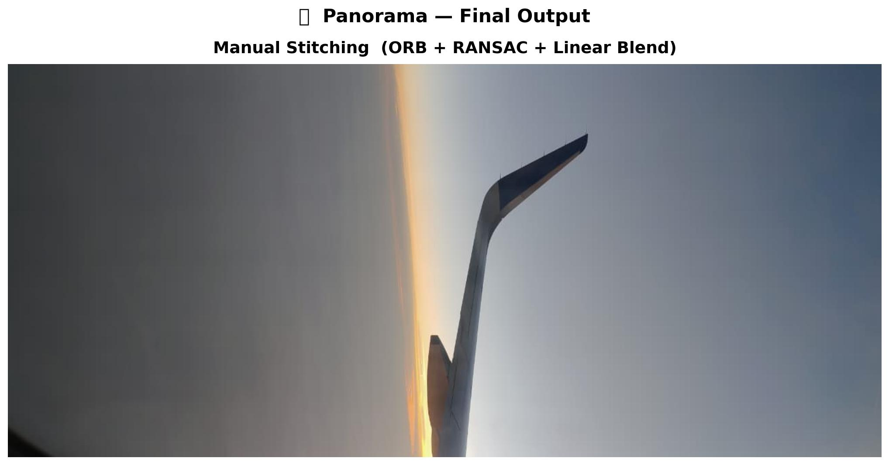

# 🖼️ Lab 5 — Image Stitching & Panorama Creation

**Course:** Computer Vision

**Professor:** Chintan Patel

**Student:** Priya A

## 🎯 Objective

Implement an end-to-end **image stitching pipeline from scratch** using classical computer vision methods in Python + OpenCV, and compare results with OpenCV's built-in `Stitcher` class.

The goal is to understand every step of panorama creation — from raw overlapping photos to a single seamless wide image — without relying on any black-box functions.

---

## 📷 Why I Chose These Images

I used **photos taken from an airplane window** — specifically shots of the **aircraft wing/tail at sunset**, captured during a flight.

I chose these images for the following reasons:

- **Real-world challenge:** Airplane window photos represent a genuinely difficult stitching scenario. The sky has large uniform gradient regions with very few textures — this is exactly the kind of challenge the lab asks us to handle.
- **Personal photos:**  These images were taken directly from my phone during travel.
- **Overlapping content:** Consecutive shots captured the wing structure from slightly different angles, creating the overlap needed for feature matching.
- **Interesting failure case:** These images intentionally push the limits of classical stitching — the sky background has almost no corners or blobs for ORB to detect. This gave me a chance to observe and explain WHY OpenCV's auto-stitcher fails (Status Code 1), while the manual pipeline still succeeds by directly controlling RANSAC thresholds.

> The airplane wing acts as the **anchor feature** — it has clear edges, curves, and structure that ORB can reliably detect even against a plain sky background. This is why 27 good matches were found between the best pair.

---

## 🔧 Full Pipeline (What My Code Does)

### Step 1 — Load & Preprocess Images
```python
# Load all images from /content/images folder
images = []
for file in sorted(os.listdir(folder_path)):
    img = cv2.imread(img_path)
    img = cv2.rotate(img, cv2.ROTATE_90_CLOCKWISE)  # Fix portrait orientation
    images.append(img)
```
Since photos were taken in **portrait mode** on a phone, each image is rotated 90° clockwise to convert to landscape before stitching.

---

### Step 2 — Feature Detection with ORB
```python
orb = cv2.ORB_create(nfeatures=10000)
gray = cv2.equalizeHist(gray)   # Improve contrast first
kp, des = orb.detectAndCompute(gray, None)
```
- **ORB (Oriented FAST and Rotated BRIEF)** is used because it is fast, free (no patent restrictions like SIFT/SURF), and works well on real-world photos.
- **Histogram equalization** (`equalizeHist`) is applied first to improve contrast in low-light/sky regions, helping ORB find more keypoints.
- `nfeatures=10000` was set higher than default to maximize detections in low-texture sky areas.

---

### Step 3 — Feature Matching (BFMatcher + Lowe's Ratio Test)
```python
bf = cv2.BFMatcher(cv2.NORM_HAMMING, crossCheck=False)
matches = bf.knnMatch(des1, des2, k=2)

good = []
for m, n in matches:
    if m.distance < 0.75 * n.distance:   # Lowe's ratio test
        good.append(m)
```
- **BFMatcher (Brute-Force)** compares every descriptor in image 1 against every descriptor in image 2.
- **Lowe's ratio test (0.75 threshold)** keeps only matches that are clearly better than the second-best match — this removes most false matches.
- Result: **27 good matches** found between the best overlapping pair (`images[2]` ↔ `images[3]`).

---

### Step 4 — Homography Estimation with RANSAC
```python
H, mask = cv2.findHomography(src_pts, dst_pts, cv2.RANSAC, 5.0)
```
- **Homography** is a 3×3 matrix describing the projective transformation between two image planes.
- **RANSAC (Random Sample Consensus)** makes the estimation robust against outlier matches by:
  1. Randomly sampling 4 point pairs
  2. Computing H from them
  3. Counting inliers (points that agree with H within 5px threshold)
  4. Keeping the H with maximum inliers
- Output: The computed matrix shown in output — values like `2.29e-02`, `3.38e-02` etc. represent the geometric transformation between the two images.

---

### Step 5 — Image Warping
```python
result = cv2.warpPerspective(img1, H, (w2*2, h2))
result[0:h2, 0:w2] = img2
```
- `warpPerspective` projects `img1` into `img2`'s coordinate frame using the homography.
- Canvas size is doubled horizontally (`w2*2`) to make space for the stitched image on the right.

---

### Step 6 — Linear Blending (Improved Version)
```python
alpha = np.where(overlap > 0, 0.5, mask1)
result = (warped1 * alpha3 + warped2 * (1 - alpha3)).astype(np.uint8)
```
- In the **overlap region**, both images are blended 50/50 using alpha compositing.
- Outside the overlap, whichever image has valid pixels is used directly.
- This removes the hard visible seam from the basic warp-and-place approach.

---

### Step 7 — Auto-Orientation Fix
```python
def to_landscape(img):
    h, w = img.shape[:2]
    if h > w:
        return cv2.rotate(img, cv2.ROTATE_90_CLOCKWISE)
    return img

# After stitching, check result is wide not tall
if result_height > result_width:
    result = cv2.rotate(result, cv2.ROTATE_90_COUNTERCLOCKWISE)
```
The final output is automatically checked and rotated if it comes out portrait instead of landscape.

---

## 📊 Results

### Manual Stitching Output


The airplane wing and tail structure is visible stitched across two images, with the sunset sky blending smoothly between them.

---

## ⚖️ Method Comparison

| Method | Status | Reason |
|--------|--------|--------|
| **Manual (ORB + RANSAC + Blend)** | ✅ Success | Full control over thresholds |
| **OpenCV Stitcher — PANORAMA mode** | ❌ Status Code 1 |  explanation below |
| **OpenCV Stitcher — SCANS mode** | ❌ Status Code 1 |  explanation below |

### Why OpenCV Stitcher Failed (Status Code 1)

`Status Code 1 = Stitcher_ERR_NEED_MORE_IMGS`

OpenCV's Stitcher internally uses a **confidence threshold** to decide whether two images are reliably matched. Because our airplane window photos have:

- Large **uniform sky** regions (no texture → ORB finds few keypoints there)
- **Gradient background** (smooth colour changes → no corners or blobs)
- Limited **unique structure** (only the wing/tail has clear edges)

...the confidence score falls below OpenCV's internal threshold and it rejects the pair as "not enough matching images."

The **manual pipeline succeeded** because we directly controlled:
- `nfeatures=10000` (much higher than OpenCV's default)
- `equalizeHist` preprocessing to boost contrast
- `RANSAC threshold = 5.0px` (lenient enough for our image quality)
- No minimum confidence gating — we accepted 27 matches directly

 learning point: **classical stitching on real-world challenging images often requires manual tuning that built-in wrappers don't expose.**

---

## 🧠 Key Concepts Learned

| Concept | What I Understood |
|---------|------------------|
| **ORB** | Fast feature detector using FAST corners + BRIEF descriptors; rotation & scale invariant |
| **Lowe's Ratio Test** | Removes ambiguous matches by comparing best vs 2nd-best match distance |
| **RANSAC** | Robustly estimates homography even with noisy/wrong matches |
| **Homography** | 3×3 projective transform that maps one camera view to another |
| **Linear Blending** | Alpha compositing in overlap zone for smooth panorama seams |
| **Histogram Equalization** | Preprocessing step to boost contrast in low-texture image regions |
| **Portrait→Landscape Fix** | Phone photos need 90° rotation before stitching horizontally |

---

## 🗂️ Files in This Folder

| File | Description |
|------|-------------|
| `lab_5_assignment.ipynb` | Full Colab notebook — all code cells with outputs |
| `final_panorama_FIXED.jpg` | Final stitched panorama output |
| `README.md` | This file |

---


## 📚 References

- Lab slides: CV_L5.pptx — Prof. Chintan Patel
